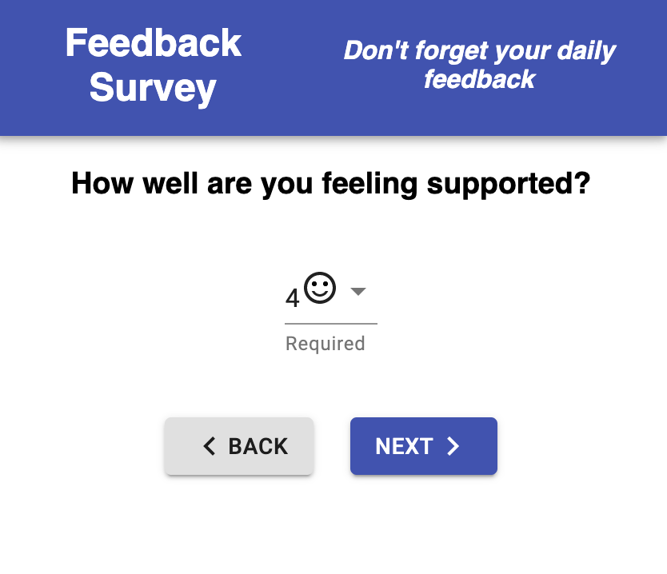
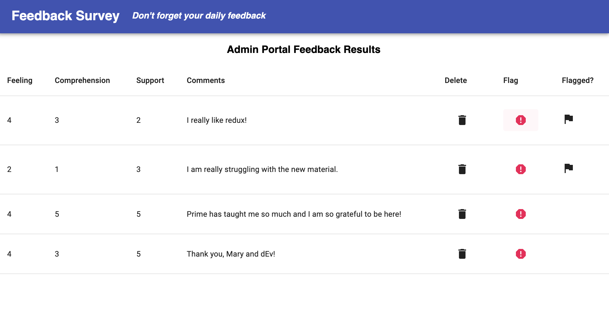

# Redux Feedback Survey

## Description

_Weekend Project_

This weekend I set out to build a feedback survey similar to Prime Digital Academy's daily reflection page.  This short survey will require a user to rank the way they are feeling, understanding new material, and being supported on a given day. It also features an optional comment field and an admin view(accessable [here](https://redux-feedback-ace.herokuapp.com/#/admin) ).  An admin can view all recorded feedback, flag any concerning lines, and delete old or incomplete data. 

To see the fully functional site, please visit: [Redux Feedback](https://redux-feedback-ace.herokuapp.com/#/)

## Screen Shots

### Prerequisites

- [Node.js](https://nodejs.org/en/)
- [Postgres](https://www.postgresql.org/download/)

## Installation

1. Create a database named `prime_feedback`,
2. The queries in the `tables.sql` file are set up to create all the necessary tables and populate the needed data to allow the application to run correctly. The project is built on [Postgres](https://www.postgresql.org/download/), so you will need to make sure to have that installed. We recommend using Postico to run those queries as that was used to create the queries, 
3. Open up your editor of choice and run an `npm install`
4. Run `npm run server` in your terminal
5. Run `npm run client` in your terminal
6. The `npm run client` command will open up a new browser tab for you!

## Usage

1. Begin the survey by clicking 'Begin'
2. Rank feeling, understanding and support by clicking the appropriate drop down option
3. Once a choice has been made, the user is able to click the next button to navigate to the next step in the survey
4. When the survey is completed, click to review
5. Upon review, changes can be made by navigating back to the relevant page
6. When ready, submit survey results from review page.
7. To access admin view and delete or flag any submitted feedback, navigate to localhost:3000/#/admin

## Built With

React.js
React-redux
node.js
express.js
Material-UI
PostgreSql

## Acknowledgement
Thanks to [Prime Digital Academy](www.primeacademy.io) who equipped and helped me to make this application a reality. Special thanks to Mary, dEv, and the Paxos cohort. Bird up!
